<p align="center">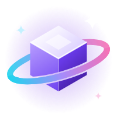</p>

# Nimbus Launcher

A fast, good-looking launcher for **Minecraft: Java Edition** with licensed (Microsoft) accounts.

- **Every version.** Everything in Mojang's manifest: releases, snapshots, April Fools versions, beta, alpha and 2009 pre-classic (`rd-132211`).
- **Every loader.** Vanilla, Fabric, Quilt, Forge (1.6.1+) and NeoForge, each with its own loader version picker.
- **Browse Modrinth.** Search mods, modpacks, resource packs and shaders. The results are filtered to fit the instance you install into, and required dependencies come along automatically.
- **Modpacks.** Install `.mrpack` packs from Browse, or import a file you already have.
- **Your own files.** An *Add file* button on every Browse tab and instance tab (mods, packs, shaders), or just drop files on the window. Resource packs and shader packs you add, however you add them (even straight into the folder), are switched on for you the next time you play.
- **Nimbus Features in game.** Press *Nimbus Features* in the pause menu or title screen (or Right Shift) for 18 HUD boxes you can drag and resize (FPS, coordinates, keystrokes, CPS, ping and more), zoom, fullbright, one-click FPS presets and 20+ other options.
- **Make it yours.** Six themes, accent colours (or your own two), animated backgrounds (aurora, starfield, neon grid) or any picture, glass, card styles, corners, UI size and sidebar labels. Every animation, in the launcher, the launch splash and the game, has its own switch.
- **Player counter.** The top of the window shows how many people have Nimbus open, how many are playing, and how many have installed it. It is anonymous and can be turned off.
- **FPS Boost.** One click tunes an instance for more, steadier frames (details below).
- **Right Java, automatically.** Nimbus downloads Mojang's own Java runtime for each version (8, 16, 17, 21 or 25), so you never install Java yourself.
- **Nimbus loading screen.** Hit Play and an animated Nimbus splash follows the launch. In Fabric and Quilt instances the game itself then loads on the Nimbus screen instead of Mojang's red one, through the built-in **Nimbus Core** mod.
- **Skins & capes.** Search thousands of skins or copy any player's skin by name, try them on a 3D player, keep a wardrobe and switch capes, right in the launcher. In Fabric and Quilt games you can do all of it from the title screen or the pause menu too.
- **Updates itself.** Every time it opens, Nimbus checks for a new version, downloads it and restarts into it (it waits while you play or download, and *Later* keeps it for the next close). Settings has a *Check now* button too.
- Live game console, crash detection, play time, one-click Repair, instance duplication, update checks for installed content, and an auto-join server option.


| Your look | Settings |
|---|---|
| 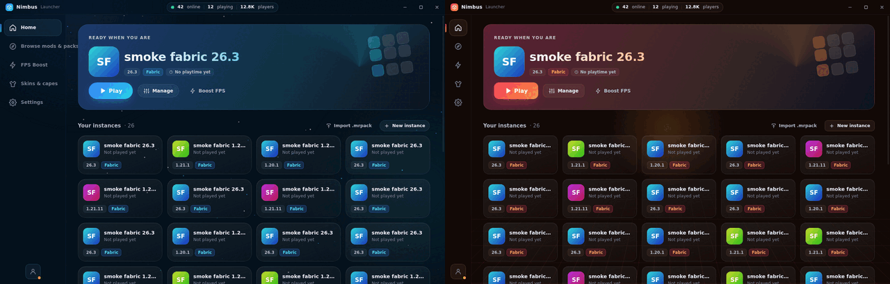 | 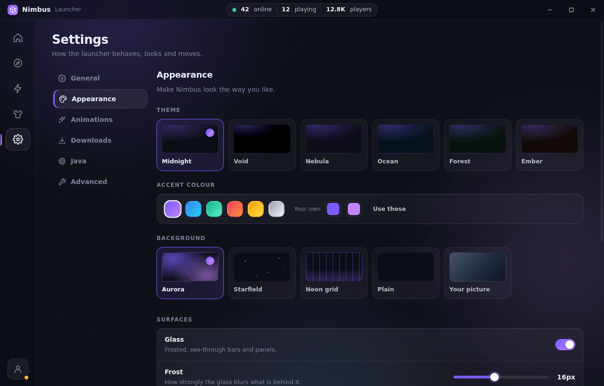 |

| New instance | FPS Boost |
|---|---|
|  |  |

## Running it

You need [Node.js](https://nodejs.org) 20 or newer.

```bash
git clone https://github.com/flayniks/nimbus-launcher.git
cd nimbus-launcher
npm install
npm start          # run the launcher
npm test           # offline unit tests
```

### Building an installer

```bash
npm run dist:win     # NSIS installer + latest.yml update feed -> dist/
npm run dist:mac     # .dmg
npm run dist:linux   # AppImage
```

Build each platform on that platform. Cross-building Windows and macOS installers only partly works.

## Downloading

**[Download Nimbus-Launcher-Setup.exe](https://github.com/flayniks/nimbus-launcher/releases/latest/download/Nimbus-Launcher-Setup.exe)**. The link always gives the newest version. It's a normal installer with desktop and Start menu shortcuts. It isn't code-signed, so Windows SmartScreen may say "Windows protected your PC". Click **More info → Run anyway**.

Once installed, it keeps itself up to date.

## Publishing an update

1. On GitHub, open **Actions → Release → Run workflow**.
2. Pick **patch** (1.1.0 → 1.1.1), **minor** (→ 1.2.0) or **major** (→ 2.0.0) and press **Run workflow**.

That's it. The workflow bumps the version, commits it, builds the installer on Windows, publishes a `nimbus-v…` release, and refreshes the `nimbus-latest` release that installed launchers check. Every launcher finds the update the next time it opens (or within four hours if it stays open), downloads it, and restarts into it after a five-second countdown. It holds off while a game or a download is running. **Later** skips the countdown, and then the update installs the next time the launcher closes. After the restart the launcher says which version it's on.

Pushing to `main` also rebuilds the installer, but a launcher only updates when the version number goes up. So when you want people to get a change, use the button (or bump `version` in `package.json` yourself).

Don't delete the `nimbus-latest` release: it's the update feed.

## Skins & capes

The **Skins & capes** page shows your player in 3D (idle, walk, run or fly with an elytra) and changes your look for every version and server.

| Try it on | Find skins |
|---|---|
| 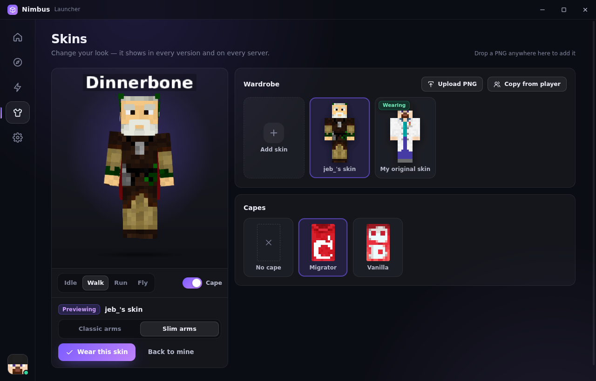 | 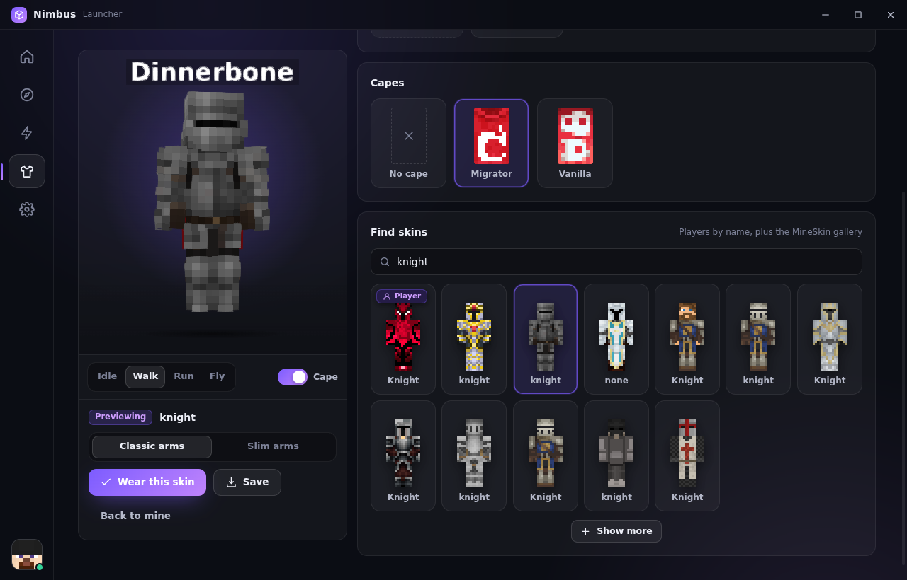 |

- **Wardrobe.** Skins you add are kept on this computer, so you can switch back and forth. The skin you had the first time you opened the page is saved in it, so changing is never a one-way trip.
- **Find skins.** One search box for both: type a player's name to get the skin they wear right now, or a word like *knight* or *hoodie* to search the [MineSkin](https://mineskin.org) gallery. Click a result to try it on, then wear it or save it.
- **Add your own** by uploading a PNG or dropping one anywhere on the page.
- **Try before you wear.** Click a skin to preview it and pick classic or slim arms, then press *Wear this skin*.
- **Capes.** Every cape your account owns, plus *No cape*. The preview shows it on your back.

The same wardrobe is in the game. Nimbus Core adds a **Skins & Capes** button to the title screen (top right) and the pause menu (top left). There you can pick a skin, switch arms, cycle through your capes, turn the preview around and press *Wear it*. Its search box works like the launcher's: type a player's name or a word, click a result, and wear it (it's saved to your wardrobe too) or just *Save* it. You can drop PNG files onto the game window to add them. On 1.20–1.21 *Add skin* opens a file picker; on 26.x it opens the wardrobe folder, and PNGs copied there show up by themselves.

| In the menu | Searching by player name | In a world |
|---|---|---|
| 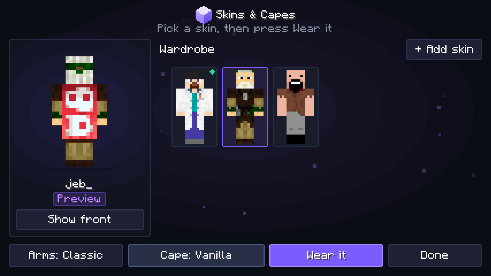 | 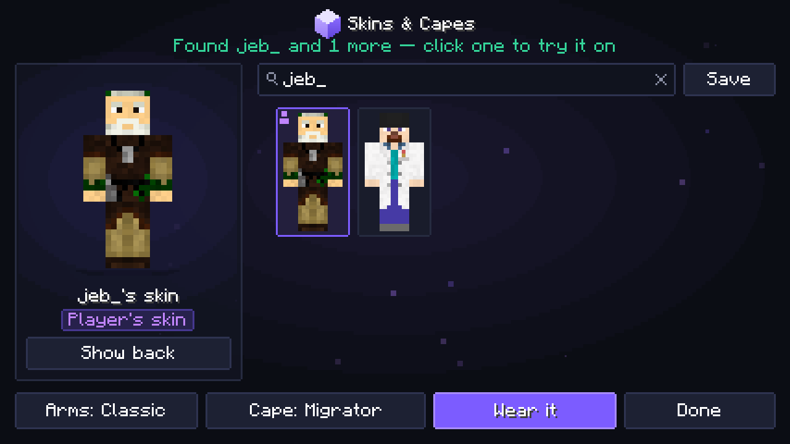 | 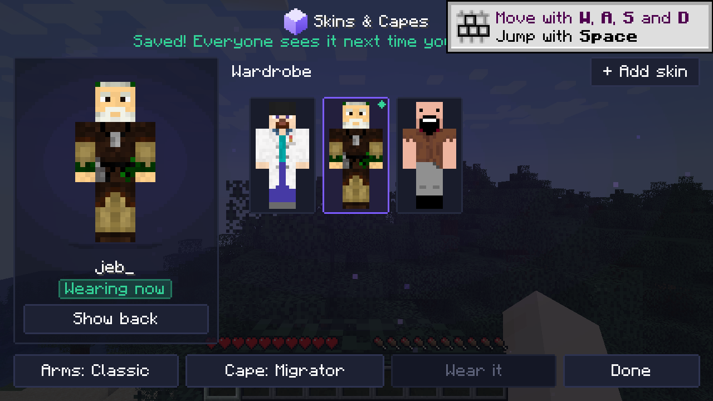 |

Skins go through Mojang's own skin service with the account you're signed in with, so nothing is server-side or mod-only: everyone sees your new look the next time you join a server. Mojang allows a few changes a minute.

## Nimbus Core and the loading screen

Nimbus Core ([`mod/`](mod/README.md)) is a small Fabric mod that ships inside the launcher. It replaces Minecraft's red Mojang loading screen with an animated Nimbus one (pixel-art cube, drop-in lettering, particles, progress bar), adds a Nimbus badge to the title screen, and adds the in-game Skins & Capes and Nimbus Features menus.

| In-game loading screen | Title screen badge | Launch splash |
|---|---|---|
| 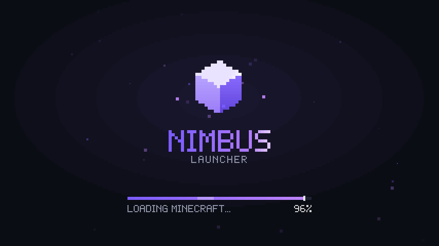 | 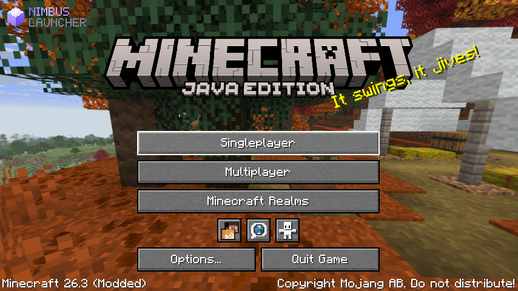 | 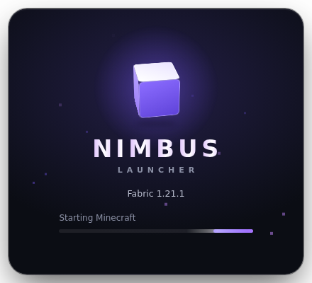 |

- It is put into every **Fabric** and **Quilt** instance on **1.20–1.21.11** and **26.x** before each launch.
- It shows as **Built in** in the instance's mod list, with no off switch or delete button. If someone disables or deletes the file by hand, it comes back on the next launch.
- Forge, NeoForge, vanilla and older versions don't get it. Those still get the launcher's own animated splash while the game starts.

The splash is a separate window that shows from Play until the game opens its window. It follows the downloads, Java and mod loading as they happen. Click it to hide it, or change or turn it off in *Settings → Animations*.

## Nimbus Features (in game)

In Fabric and Quilt games, **Nimbus Features** sits on the left of the pause menu and in the top-left corner of the title screen (under the Nimbus badge, clear of the Minecraft logo; on a narrow screen it becomes a small icon button), and Right Shift opens it anywhere in game.

| The menu | Editing the HUD | In a world |
|---|---|---|
| 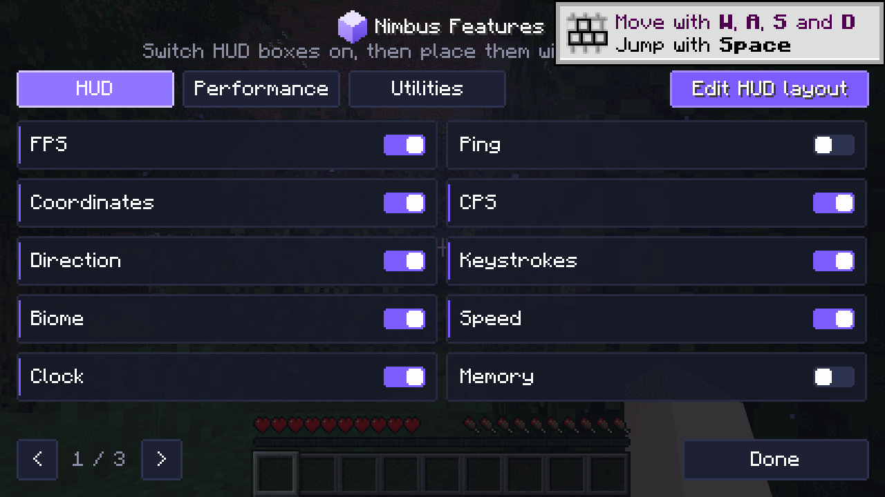 | 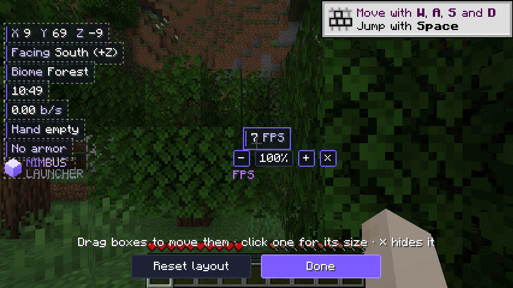 | 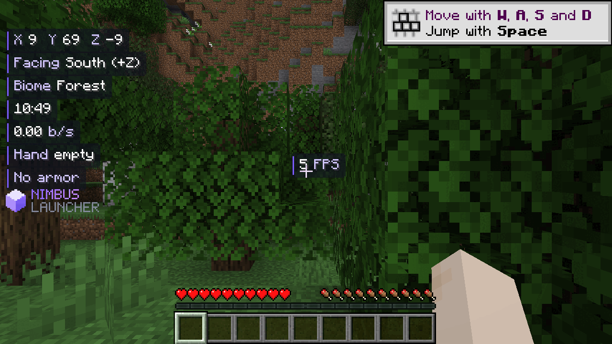 |

- **HUD:** FPS, coordinates, direction, biome, clock, ping, CPS, keystrokes, speed, memory, held item, armour, server, light level, day counter, session time, chunk and the Nimbus logo. Switch them on, press *Edit HUD layout*, then drag them anywhere. Click one to resize or hide it. Boxes snap to the edges and the centre. Box style, accent colour, text shadow and a 12/24-hour clock are in the same tab.
- **Performance:** Max FPS / Balanced / Quality presets, a background FPS limit (the game barely runs while it's in the background), render and simulation distance, max frame rate, VSync, graphics, particles, clouds, entity shadows, smooth lighting, biome blend and entity distance.
- **Utilities:** zoom (hold C, five strengths, smooth or instant), fullbright, toggle sprint and sneak, no hurt shake, no view bobbing, the inventory watermark and the Right Shift shortcut.

The settings are shared by every instance, so your HUD looks the same everywhere.

## Make it yours

Settings has an **Appearance** section and an **Animations** section.

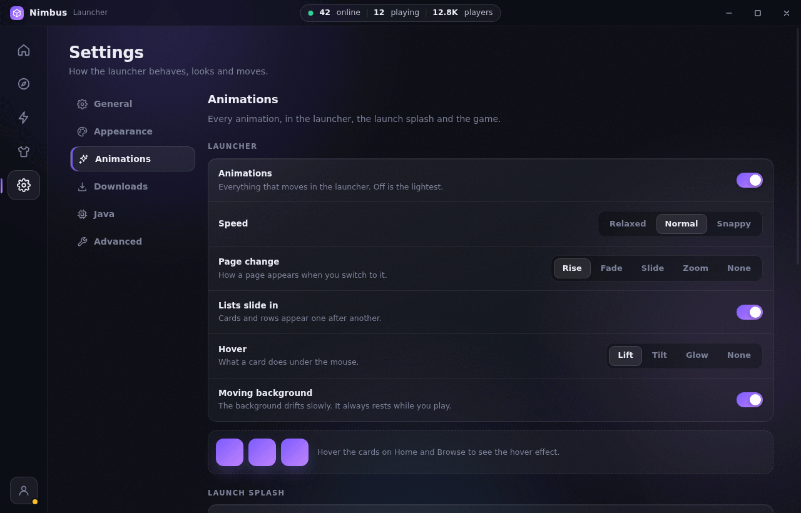

- **Appearance:** theme (Midnight, Void, Nebula, Ocean, Forest, Ember), accent colour (six presets or two colours of your own), background (Aurora, Starfield, Neon grid, Plain or your own picture with blur and darken), glass and how frosted it is, card style, corners, UI size (90–125%) and sidebar labels.
- **Animations in the launcher:** on/off, speed, how pages change (rise, fade, slide, zoom or none), lists sliding in, what cards do on hover (lift, tilt, glow or nothing) and the moving background.
- **Launch splash:** on/off, particles, and how the logo moves: **Spin**, **Bounce** (hops with squash and stretch), **Splash** (drops in and lands in rippling water), **Pulse** (beats and sends out waves), **Flip**, **Still** or **Minimal** (just the name). Every choice has a live preview card.
- **In the game** (through Nimbus Core): the Nimbus loading screen (off shows Mojang's), particles, animation speed, the title screen badge, the moving glow behind the Nimbus menus, and the same logo styles picked separately for **when the game starts** and **when resource packs load** (F3+T, or changing packs in game).

## Player counter

The pill at the top of the window shows people online (with Nimbus open), people playing, and everyone who has installed Nimbus. Each launcher adds one to a counter for the current five-minute window, and one to "playing" while a game runs. The all-time counter goes up once per install. No account, name or ID is sent, only anonymous counter bumps ([Abacus](https://abacus.jasoncameron.dev)). *Settings → General* can hide the counter or stop counting you.

## Resource packs and shaders

Minecraft never switches on a new pack by itself, so Nimbus does it for you. Before each launch it looks for resource packs and shader packs it hasn't seen in that instance before, and turns them on: resource packs go on top of the list in `options.txt` (also marked as accepted, so a pack made for another version still loads), and a new shader pack is selected for Iris, Oculus or OptiFine. Packs that were already there are left alone, so one you turn off in game stays off.

## FPS Boost

Pick a preset (**Potato**, **Balanced** or **Max FPS**) and switch individual parts on or off:

| Part | What it does |
|---|---|
| Performance mods | Installs whichever of these have a build for the instance: Sodium (or Embeddium on older Forge), Lithium, FerriteCore, EntityCulling, ImmediatelyFast, ModernFix, Dynamic FPS, More Culling and BadOptimizations. It skips anything already installed, and skips Sodium when OptiFine is present. |
| Garbage collector | Tuned G1 flags. The **Max FPS** preset uses generational ZGC on Java 21+ machines with 12 GB+ RAM and a 4 GB+ heap. A GC you set in the instance's JVM arguments always wins. |
| Smart memory | Sizes the heap to the mod count (2–8 GB) and never gives Java more than half your RAM. Too much heap makes GC pauses longer. |
| Video settings | Writes render/simulation distance, graphics mode, clouds, particles, shadows, mipmaps and biome blend into `options.txt`, with VSync off and FPS uncapped. The original file is backed up once, and **Revert** restores it. Keys are written in the format each game era expects. |
| Process priority | Raises Minecraft's priority when it starts. On Linux/macOS this needs admin rights, and is skipped quietly without them. |
| Dedicated GPU | Windows only. Tells Windows to run Java on the discrete GPU on laptops that have two. |

Performance mods need a mod loader. For a vanilla instance, the boost still tunes Java, memory and video settings, and suggests a Fabric instance or the Fabulously Optimized modpack.

The launcher stays out of the game's way too. By default it hides itself while you play. Its background animation pauses when a game is running, animations can be turned off completely, and progress updates are throttled so the UI never floods.

## How it works

```
main.js / preload.js         Electron shell, IPC, Microsoft sign-in window
src/core/                    everything that is not UI (plain Node, testable without Electron)
  launcher.js                facade the UI talks to: tasks, prepare, launch
  builtin.js                 keeps Nimbus Core in Fabric/Quilt instances
  versions.js                Mojang manifest, version JSON inheritance
  install.js                 libraries, natives, assets (incl. pre-1.6 and legacy virtual assets), log4j config
  java.js                    Mojang Java runtimes, system Java discovery
  loaders/fabric.js          Fabric and Quilt profiles
  loaders/forge.js           Forge/NeoForge installers: install_profile, library download, processors
  launch.js                  argument building and spawning
  auth.js / accounts.js      Microsoft → Xbox Live → Minecraft sign-in, encrypted token storage
  modrinth.js                search, dependency resolution, .mrpack, update checks
  boost.js                   the FPS Boost
src/renderer/                the UI: vanilla JS modules, no framework (splash.html is the launch splash)
mod/                         Nimbus Core, the built-in Fabric mod (Gradle, see mod/README.md)
resources/mods/              the built Nimbus Core jars the launcher ships
```

- **Storage.** Everything lives in one folder (Settings → Storage). Libraries, assets and Java runtimes are shared between instances. Each instance has its own `minecraft` folder for worlds, mods and `options.txt`.
- **Downloads** run in parallel (16 at a time by default), are verified against their SHA-1 after download, and are skipped when a file with the right size already exists. That makes a second launch of an instance take under a second to prepare. **Repair** re-hashes everything.
- **Forge and NeoForge** are installed straight from their official installer jars. Nimbus reads `install_profile.json`, fetches the libraries and runs the installer's processors with the game's own Java. The installer UI never appears. Forge 1.6–1.12 installers have no processors, so their files are simply unpacked.
- **Sign-in** opens Microsoft's own login page in a separate window. Nimbus never sees your password. It keeps only the refresh token and the Minecraft token, sealed with your OS keychain through Electron's `safeStorage`. By default it uses the public Minecraft client ID that most open-source launchers use. If you have your own Azure app approved for the Minecraft API, set its client ID in Settings.
- **Security.** The UI runs sandboxed with context isolation and a strict CSP, and has no network access of its own. Modrinth descriptions are sanitized with DOMPurify, and only `https` links open, always in your browser.

## Tested

With `test/smoke.js`, which installs an instance for real and starts the game under a virtual display:

- vanilla: `rd-132211`, `b1.7.3`, 1.8.9, 1.21.1, 26.3
- Fabric: 1.21.1, 26.3
- Quilt: 1.20.1
- Forge: 1.6.4, 1.7.10, 1.12.2, 1.20.1 (processors)
- NeoForge: 1.21.1, 26.3
- modpack: Fabulously Optimized (`node test/smoke.js modpack fabulously-optimized`)

Every one of them started, loaded its mod loader and got as far as creating the game window. The 1.8.9, 1.12.2 and 26.x runs failed at that last step, because the headless test machine's virtual display cannot give them the display modes or OpenGL context they ask for. The rest rendered. The UI flows were exercised in the real Electron app: create an instance, browse, add a mod with its dependencies, apply the FPS Boost, launch with the live console, then stop.

Nimbus Core was checked in real games on the virtual display on Fabric 1.20.1, 1.21.1, 1.21.11 and 26.3, and on Quilt 1.21.1. Each one loaded on the Nimbus screen, faded straight to the title screen with the badge, and never showed Mojang's red screen or got stuck. The variable it hides the Mojang logo with was checked in the bytecode of every release from 1.20 to 26.3.

The skins page was tested against stand-ins for Mojang's skin service, its name lookup and the MineSkin gallery (`test/mock-services.js`): search by player name and by keyword, save a result, preview, wear with slim arms, switch capes and hide the cape. The search was also run against the real gallery and Mojang. The in-game menu was tested the same way on Fabric 1.20.1, 1.21.1, 1.21.11 and 26.3: from the title screen and from the pause menu in a world, typing a player's name, wearing their skin, searching a keyword and saving a result. Every game method the menu calls was checked to exist in each release from 1.20 to 26.3.

Nimbus Features was tested in real games on Fabric 1.20.1, 1.21.1, 1.21.11 and 26.3: opening the menu from the pause menu, the title screen and Right Shift, switching HUD boxes on, dragging and resizing them in the editor, zoom and the inventory watermark. The in-game animation options were checked on 1.21.1 (Mojang's loading screen, no badge, flip) and on 26.1.2 and 26.3 (still logo, no particles, bounce and pulse at start, splash on an F3+T resource reload, which now fades straight back into the world). The inventory watermark was checked on 1.21.1 and 26.1.2. The launcher's look (themes, backgrounds, your own picture and colours, shapes, size), the animation settings, the player counter (against a stand-in counter) and the *Add file* buttons were run through in the real Electron app.

The updater was tested by having a 1.0.0 build read a local copy of the release feed, find 1.1.0, download it and verify its checksum. The final "install and restart" step only runs on Windows.

The one thing that cannot be tested without a real Microsoft account is the sign-in round trip.

## Limits

- Content search is Modrinth only. CurseForge's API needs a private key.
- Forge older than 1.6 was a jar mod with no launcher profile, so it is not offered.
- Linux on ARM has no Mojang Java runtime. Install a matching Java yourself and pick it in the instance settings.
- On Apple Silicon and Windows on ARM, versions without ARM natives (1.18 and older) run on the x64 Java under Rosetta/emulation.

Nimbus is not affiliated with Mojang or Microsoft. Forge is funded by the ads on its download site. If you use it a lot, consider supporting it.
