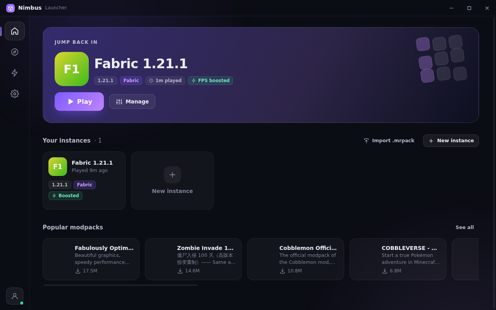
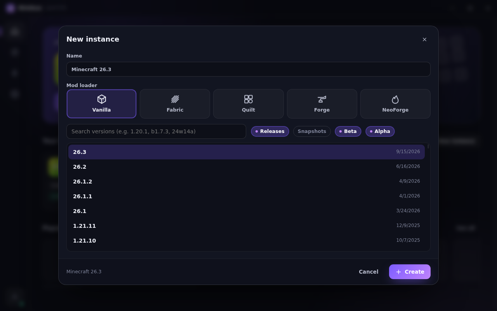
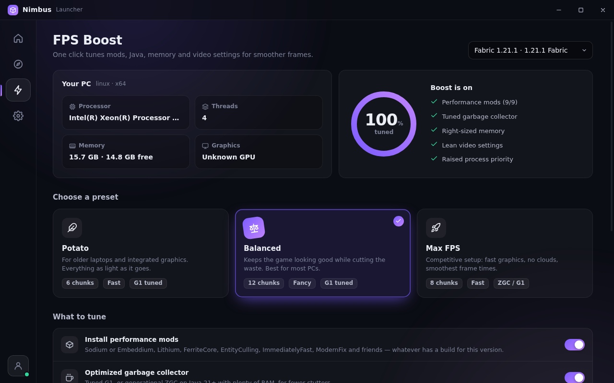

# Nimbus Launcher

A fast, good-looking launcher for **Minecraft: Java Edition** with licensed (Microsoft) accounts.

- **Every version.** Everything in Mojang's manifest: releases, snapshots, April Fools versions, beta, alpha and 2009 pre-classic (`rd-132211`).
- **Every loader.** Vanilla, Fabric, Quilt, Forge (1.6.1+) and NeoForge, each with its own loader version picker.
- **Browse Modrinth.** Search mods, modpacks, resource packs and shaders. The results are filtered to fit the instance you install into, and required dependencies come along automatically.
- **Modpacks.** Install `.mrpack` packs from Browse, or import a file you already have.
- **FPS Boost.** One click tunes an instance for more, steadier frames (details below).
- **Right Java, automatically.** Nimbus downloads Mojang's own Java runtime for each version (8, 16, 17, 21 or 25), so you never install Java yourself.
- Live game console, crash detection, play time, one-click Repair, instance duplication, update checks for installed content, and an auto-join server option.



| New instance | FPS Boost |
|---|---|
|  |  |

## Running it

You need [Node.js](https://nodejs.org) 20 or newer.

```bash
cd launcher
npm install
npm start          # run the launcher
npm test           # offline unit tests
```

### Building an installer

```bash
npm run dist:win     # NSIS installer   -> dist/
npm run dist:mac     # .dmg
npm run dist:linux   # AppImage
```

Build each platform on that platform. Cross-building Windows and macOS installers only partly works.

## FPS Boost

Pick a preset (**Potato**, **Balanced** or **Max FPS**) and switch individual parts on or off:

| Part | What it does |
|---|---|
| Performance mods | Installs whichever of these have a build for the instance: Sodium (or Embeddium on older Forge), Lithium, FerriteCore, EntityCulling, ImmediatelyFast, ModernFix, Dynamic FPS, More Culling and BadOptimizations. It skips anything already installed, and skips Sodium when OptiFine is present. |
| Garbage collector | Tuned G1 flags. The **Max FPS** preset uses generational ZGC on Java 21+ machines with 12 GB+ RAM and a 4 GB+ heap. A GC you set in the instance's JVM arguments always wins. |
| Smart memory | Sizes the heap to the mod count (2–8 GB) and never gives Java more than half your RAM. Too much heap makes GC pauses longer. |
| Video settings | Writes render/simulation distance, graphics mode, clouds, particles, shadows, mipmaps and biome blend into `options.txt`, with VSync off and FPS uncapped. The original file is backed up once, and **Revert** restores it. Keys are written in the format each game era expects. |
| Process priority | Raises Minecraft's priority when it starts. On Linux/macOS this needs admin rights, and is skipped quietly without them. |
| Dedicated GPU | Windows only. Tells Windows to run Java on the discrete GPU on laptops that have two. |

Performance mods need a mod loader. For a vanilla instance, the boost still tunes Java, memory and video settings, and suggests a Fabric instance or the Fabulously Optimized modpack.

The launcher stays out of the game's way too. By default it hides itself while you play. Its background animation pauses when a game is running, animations can be turned off completely, and progress updates are throttled so the UI never floods.

## How it works

```
main.js / preload.js         Electron shell, IPC, Microsoft sign-in window
src/core/                    everything that is not UI (plain Node, testable without Electron)
  launcher.js                facade the UI talks to: tasks, prepare, launch
  versions.js                Mojang manifest, version JSON inheritance
  install.js                 libraries, natives, assets (incl. pre-1.6 and legacy virtual assets), log4j config
  java.js                    Mojang Java runtimes, system Java discovery
  loaders/fabric.js          Fabric and Quilt profiles
  loaders/forge.js           Forge/NeoForge installers: install_profile, library download, processors
  launch.js                  argument building and spawning
  auth.js / accounts.js      Microsoft → Xbox Live → Minecraft sign-in, encrypted token storage
  modrinth.js                search, dependency resolution, .mrpack, update checks
  boost.js                   the FPS Boost
src/renderer/                the UI: vanilla JS modules, no framework
```

- **Storage.** Everything lives in one folder (Settings → Storage). Libraries, assets and Java runtimes are shared between instances. Each instance has its own `minecraft` folder for worlds, mods and `options.txt`.
- **Downloads** run in parallel (16 at a time by default), are verified against their SHA-1 after download, and are skipped when a file with the right size already exists. That makes a second launch of an instance take under a second to prepare. **Repair** re-hashes everything.
- **Forge and NeoForge** are installed straight from their official installer jars. Nimbus reads `install_profile.json`, fetches the libraries and runs the installer's processors with the game's own Java. The installer UI never appears. Forge 1.6–1.12 installers have no processors, so their files are simply unpacked.
- **Sign-in** opens Microsoft's own login page in a separate window. Nimbus never sees your password. It keeps only the refresh token and the Minecraft token, sealed with your OS keychain through Electron's `safeStorage`. By default it uses the public Minecraft client ID that most open-source launchers use. If you have your own Azure app approved for the Minecraft API, set its client ID in Settings.
- **Security.** The UI runs sandboxed with context isolation and a strict CSP, and has no network access of its own. Modrinth descriptions are sanitized with DOMPurify, and only `https` links open, always in your browser.

## Tested

With `test/smoke.js`, which installs an instance for real and starts the game under a virtual display:

- vanilla: `rd-132211`, `b1.7.3`, 1.8.9, 1.21.1, 26.3
- Fabric: 1.21.1, 26.3
- Quilt: 1.20.1
- Forge: 1.6.4, 1.7.10, 1.12.2, 1.20.1 (processors)
- NeoForge: 1.21.1, 26.3
- modpack: Fabulously Optimized (`node test/smoke.js modpack fabulously-optimized`)

Every one of them started, loaded its mod loader and got as far as creating the game window. The 1.8.9, 1.12.2 and 26.x runs failed at that last step, because the headless test machine's virtual display cannot give them the display modes or OpenGL context they ask for. The rest rendered. The UI flows were exercised in the real Electron app: create an instance, browse, add a mod with its dependencies, apply the FPS Boost, launch with the live console, then stop.

The one thing that cannot be tested without a real Microsoft account is the sign-in round trip.

## Limits

- Content search is Modrinth only. CurseForge's API needs a private key.
- Forge older than 1.6 was a jar mod with no launcher profile, so it is not offered.
- Linux on ARM has no Mojang Java runtime. Install a matching Java yourself and pick it in the instance settings.
- On Apple Silicon and Windows on ARM, versions without ARM natives (1.18 and older) run on the x64 Java under Rosetta/emulation.

Nimbus is not affiliated with Mojang or Microsoft. Forge is funded by the ads on its download site. If you use it a lot, consider supporting it.
